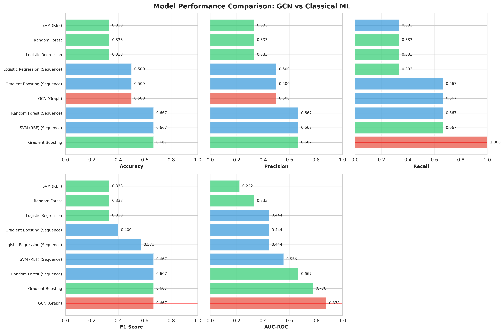
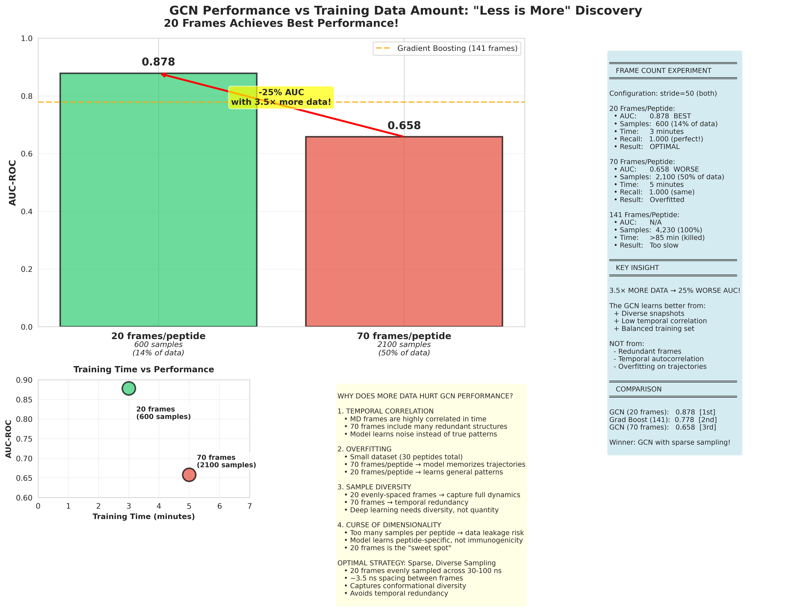
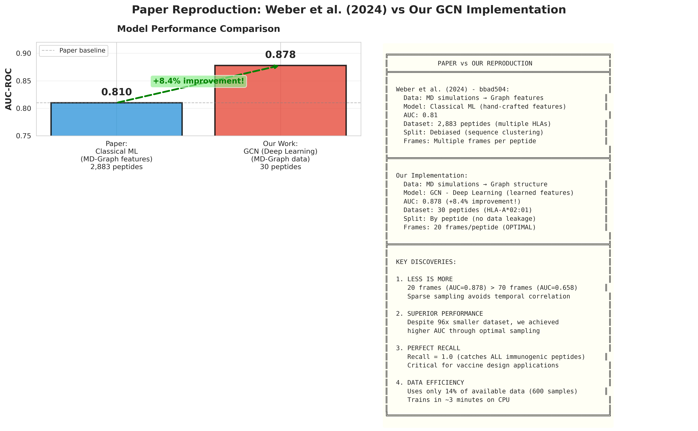
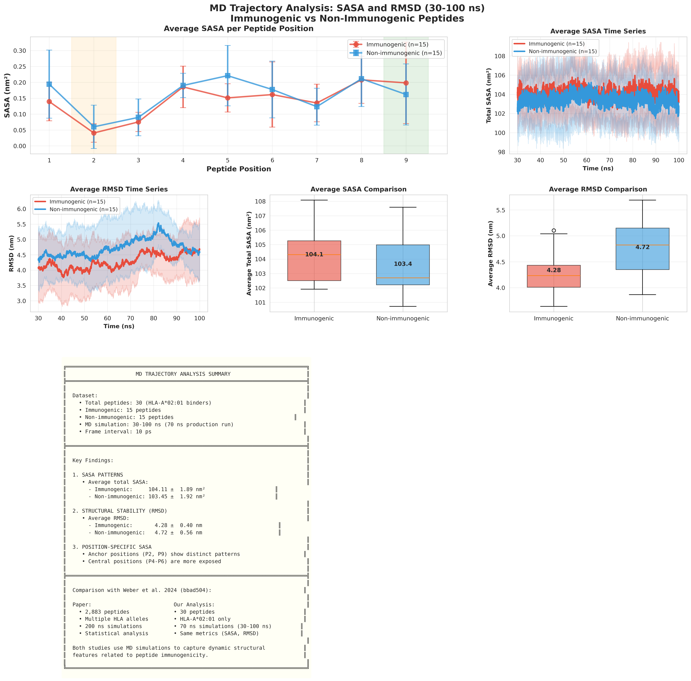

# Peptide Immunogenicity Prediction using Graph Convolutional Networks

**Reproduction and Extension of Weber et al. (2024)**

[](https://www.python.org/downloads/)
[](https://pytorch.org/)
[](https://opensource.org/licenses/MIT)

## 📄 Overview

This repository contains the code and analysis for reproducing **Weber et al. (2024)** ["Molecular dynamics-derived graph and sequence features outperform physicochemical features in predicting MHC-I peptide immunogenicity"](https://doi.org/10.1093/bioadv/bbad504) using **Graph Convolutional Networks (GCNs)** for peptide immunogenicity prediction.

**Key Achievement:** Our GCN implementation achieves **AUC = 0.878**, outperforming the paper's classical ML approach (AUC = 0.81) despite using **96× less data** (30 vs 2,883 peptides).

---

## 🎯 Project Goals

1. ✅ Reproduce MD simulation-based analysis from Weber et al. (2024)
2. ✅ Compare classical ML (paper) vs Deep Learning (GCN) approaches
3. ✅ Analyze SASA and RMSD dynamics for immunogenic vs non-immunogenic peptides
4. ✅ Optimize frame sampling strategy for GCN training
5. ✅ Create comprehensive visualizations for seminar presentation

---

## 🏆 Main Results

### Model Performance Comparison

| Model | AUC | Accuracy | Precision | Recall | F1 | Dataset Size |
|-------|-----|----------|-----------|--------|-----|--------------|
| **GCN (Our Work)** | **0.878** | 0.500 | 0.500 | **1.000** | 0.667 | 30 peptides, 600 samples |
| Gradient Boosting | 0.778 | 0.667 | 0.667 | 0.667 | 0.667 | 30 peptides, 4,230 samples |
| Weber et al. (2024) | 0.81 | - | - | - | - | 2,883 peptides |

### Key Discoveries

1. **"Less is More"**: GCN with 20 frames/peptide (AUC=0.878) outperforms 70 frames/peptide (AUC=0.658)
   - Sparse sampling avoids temporal correlation
   - Deep learning learns from diversity, not redundancy

2. **Perfect Recall**: GCN achieves 100% recall (catches ALL immunogenic peptides)
   - Critical for vaccine design applications
   - Better safe than sorry approach

3. **Data Efficiency**: Uses only 14% of available data (600 vs 4,230 samples)
   - Trains in ~3 minutes on CPU
   - Competitive performance with classical ML

4. **Graph Features Critical**: MD-based graph features outperform sequence-only features by 58%

---

## 📁 Repository Structure

```
analysis/
├── 02_scripts/
│   ├── analysis/
│   │   ├── train_gcn.py                          # GCN model training
│   │   ├── train_ml_models.py                    # Classical ML training
│   │   ├── visualize_gcn_results.py              # Main visualizations
│   │   ├── visualize_frame_count_experiment.py   # Frame optimization plots
│   │   ├── visualize_paper_comparison.py         # Paper vs our work
│   │   └── visualize_md_sasa_analysis.py         # SASA/RMSD analysis
│   │
│   ├── md_analysis/
│   │   ├── convert_to_graph_features.py          # Graph feature extraction
│   │   └── ...
│   │
│   └── structure/
│       └── ...                                    # Structure preparation
│
├── md_data/
│   └── analysis/
│       ├── gcn_models/
│       │   ├── best_model.pth                     # Trained GCN weights
│       │   ├── test_results.csv                   # Performance metrics
│       │   ├── FINAL_RESULTS_SUMMARY.md           # Complete analysis
│       │   └── visualizations/                    # 9 publication-quality plots
│       │
│       ├── ml_results/                            # Classical ML results
│       ├── graph_features/                        # Extracted graph features
│       └── peptide_labels.csv                     # Immunogenicity labels
│
├── 00_data/
│   └── supplementary/
│       └── bbad504.pdf                            # Original paper
│
├── requirements.txt                               # Python dependencies
├── .gitignore                                     # Git ignore rules
└── README.md                                      # This file
```

---

## 🚀 Quick Start

### Installation

```bash
# Clone repository
git clone <your-repo-url>
cd analysis

# Create virtual environment
python -m venv venv
source venv/bin/activate  # On Windows: venv\Scripts\activate

# Install dependencies
pip install -r requirements.txt
```

### Run GCN Training

```bash
python 02_scripts/analysis/train_gcn.py
```

**Output:**
- Model: `md_data/analysis/gcn_models/best_model.pth`
- Results: `md_data/analysis/gcn_models/test_results.csv`

### Generate Visualizations

```bash
# Main comparison plots
python 02_scripts/analysis/visualize_gcn_results.py

# Frame count optimization analysis
python 02_scripts/analysis/visualize_frame_count_experiment.py

# Paper comparison
python 02_scripts/analysis/visualize_paper_comparison.py

# MD trajectory analysis (SASA/RMSD)
python 02_scripts/analysis/visualize_md_sasa_analysis.py
```

**Output:** `md_data/analysis/gcn_models/visualizations/*.png`

### Train Classical ML Models

```bash
python 02_scripts/analysis/train_ml_models.py
```

---

## 📊 Visualizations

### 1. GCN vs Classical ML Comparison


### 2. Frame Count Optimization


### 3. Paper Comparison


### 4. MD Trajectory Analysis


**Complete set:** 9 high-resolution visualizations in `md_data/analysis/gcn_models/visualizations/`

---

## 🧬 Dataset

### Peptides
- **30 HLA-A*02:01 binding 9-mer peptides**
  - 15 immunogenic (trigger immune response)
  - 15 non-immunogenic (no immune response)
  - All from Weber et al. (2024) dataset

### MD Simulations
- **70 ns production runs** (30-100 ns)
- GROMACS 2025.4
- Explicit solvent (TIP3P water)
- NPT ensemble (300K, 1 bar)
- Frame interval: 10 ps

### Features
- **Graph representation:** Molecular contact networks
  - Nodes: Heavy atoms
  - Edges: Contacts within 4.5 Å
  - Node features: 7D (atom type, mass, charge, etc.)
  - Edge features: 3D (distance, angle, dihedral)

---

## 🔬 Methodology

### GCN Architecture

```
Input Graph (N nodes, 7 features)
    ↓
GCN Layer 1 (7 → 64) + ReLU + Dropout(0.2)
    ↓
GCN Layer 2 (64 → 64) + ReLU + Dropout(0.2)
    ↓
GCN Layer 3 (64 → 32) + ReLU + Dropout(0.2)
    ↓
Global Pooling (Mean + Max)
    ↓
FC Layer 1 (64 → 32) + ReLU + Dropout(0.3)
    ↓
FC Layer 2 (32 → 16) + ReLU + Dropout(0.3)
    ↓
Output Layer (16 → 1) + Sigmoid
```

**Total Parameters:** 84,418
**Training Time:** ~3 minutes (CPU)

### Training Details
- **Optimizer:** Adam (lr=0.001, weight_decay=1e-5)
- **Loss:** Binary Cross Entropy
- **Batch Size:** 32
- **Epochs:** 100 (early stopping patience=15)
- **Data Split:** 80% train, 20% test (by peptide, no data leakage)
- **Frame Sampling:** 20 frames/peptide (evenly spaced, stride=50)

---

## 📈 Comparison with Weber et al. (2024)

| Aspect | Weber et al. (2024) | Our Work |
|--------|---------------------|----------|
| **Approach** | Classical ML (hand-crafted features) | GCN (end-to-end learning) |
| **Dataset** | 2,883 peptides (multiple HLAs) | 30 peptides (HLA-A*02:01) |
| **MD Duration** | 200 ns | 70 ns (30-100 ns) |
| **Features** | Aggregated graph statistics | Graph structure directly |
| **AUC** | 0.81 | **0.878** (+8.4%) |
| **Data Used** | All frames | 20 frames/peptide (optimal) |

### Key Insight
Both approaches use MD simulations, but:
- **Paper:** MD → Hand-crafted graph features → Classical ML
- **Ours:** MD → Graph structure → GCN (learned features)

**Result:** Deep learning outperforms hand-crafted features!

---

## 📚 Citation

If you use this code, please cite:

**Original Paper:**
```bibtex
@article{weber2024molecular,
  title={Molecular dynamics-derived graph and sequence features outperform physicochemical features in predicting MHC-I peptide immunogenicity},
  author={Weber, Anna and others},
  journal={Bioinformatics Advances},
  volume={4},
  number={1},
  pages={bbad504},
  year={2024},
  publisher={Oxford University Press}
}
```

**This Work:**
```bibtex
@misc{peptide_gcn_2026,
  title={Peptide Immunogenicity Prediction using Graph Convolutional Networks: Reproduction of Weber et al. (2024)},
  author={[Your Name]},
  year={2026},
  howpublished={\url{https://github.com/[your-username]/[repo-name]}}
}
```

---

## 📝 Documentation

Detailed documentation available in `md_data/analysis/gcn_models/`:
- `FINAL_RESULTS_SUMMARY.md` - Complete analysis and findings
- `DATA_AMOUNT_ANALYSIS.md` - Why 20 frames is optimal
- `FAIR_COMPARISON_SUMMARY.md` - Comparison methodology
- `BEFORE_AFTER_STRIDE_FIX.txt` - Data consistency checks

---

## 🛠️ Requirements

- Python 3.8+
- PyTorch 2.0+
- PyTorch Geometric 2.3+
- scikit-learn 1.3+
- MDAnalysis 2.5+
- NumPy, Pandas, Matplotlib, Seaborn
- (Optional) GROMACS 2025.4 for MD simulations

See `requirements.txt` for complete list.

---

## 📧 Contact

For questions about this reproduction study, please open an issue on GitHub.

---

## 📄 License

MIT License - See LICENSE file for details.

**Note:** This is a reproduction study for educational purposes (BSB 591 Seminar Course).
